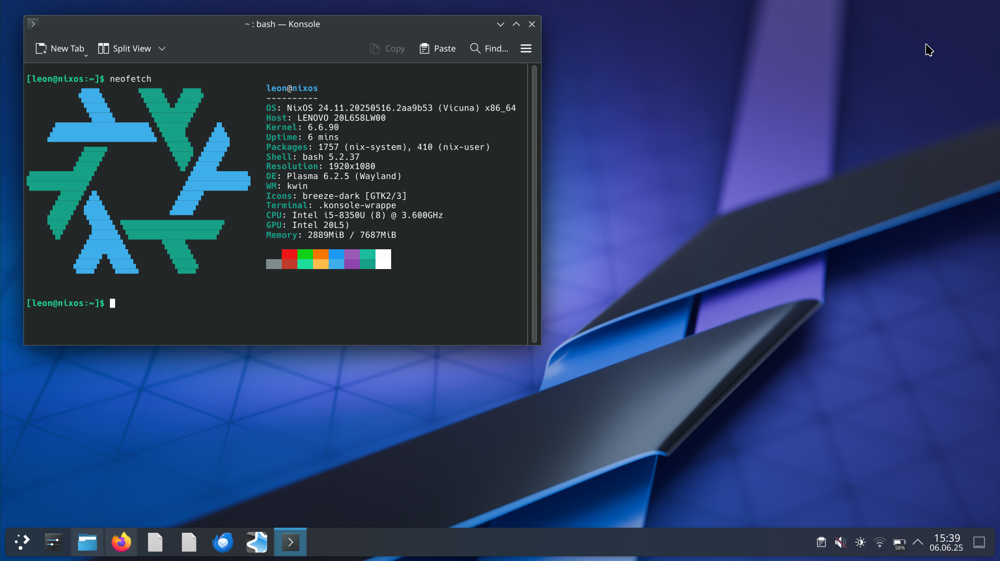

<p align="center">
  
</p>

<h1 align="center">🛰️ My NixOS & Home Manager Config</h1>

<p align="center">
  <a href="https://nixos.org/"></a>
  <a href="https://search.nixos.org/flake"></a>
  <a href="https://github.com/leondeppe/NixOS-Config/actions">
  <a href="https://github.com/leondeppe/NixOS-Config/stargazers"></a>
</p>

---

## ✨ Features

* Fully declarative **system** (`configuration.nix`) and **user** (`home.nix`) layers
* **Nix Flakes** for reproducible builds
* Clean separation of secrets → `private-stuff.nix` (not tracked)
* Does NOT include the packages I use!

---

## 🗂️ Repository layout

```text
.
├── configuration.nix          # ⇽ system-wide settings
├── home.nix                   # ⇽ user / Home-Manager modules
├── flake.nix                  # ⇽ flake definition          ┐
├── flake.lock                 # ⇽ pinned dependency graph   │
├── hardware-configuration.nix # ⇽ hardware settings
├── private-stuff.nix          # ⇽ untracked secrets import
└── desktop.png                # ⇽ screenshot of my desktop used above
